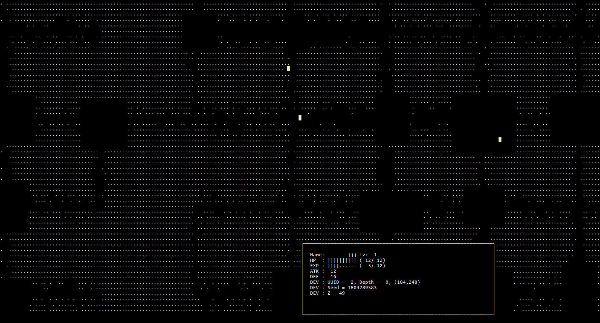

# rogue

Multiplayer roguelikes game

## Compile

```bash
mkdir build
cd build
cmake ..
make
```

## Server

```bash
./server
Rogue Server
Usage : ./server port

./server 55555                                                                                                                                                                23:40:58
Rogue Server
[0] mikoim:lolcat
[1] hoge:hoge
[2] jjj:jjj
game_init(): depth 0...OK!
game_init(): depth 1...OK!
Server is running.
game_thread(): depth 0 (seed 1804289383) is running.
game_thread(): depth 1 (seed 1960964460) is running.
```

## Client

```bash
./client 127.0.0.1 55555                                                                                                                                                      23:37:31
Rogue
   (`-')                                  (`-')  _
<-.(OO )      .->       .->        .->    ( OO).-/
,------,)(`-')----.  ,---(`-'),--.(,--.  (,------.
|   /`. '( OO).-.  ''  .-(OO )|  | |(`-') |  .---'
|  |_.' |( _) | |  ||  | .-, \|  | |(OO )(|  '--.  
|  .   .' \|  |)|  ||  | '.(_/|  | | |  \ |  .--'  
|  |\  \   '  '-'  '|  '-'  | \  '-'(_ .' |  `---.
`--' '--'   `-----'  `-----'   `-----'    `------'

[Login]
Username: jjj
Password: jjj
```


